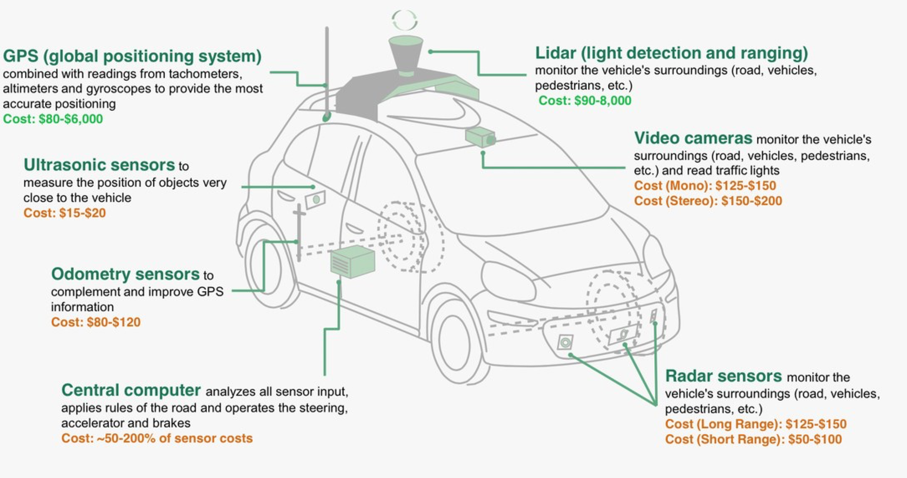

# Artificial Intelligence for Robotics
- Taught by Sebastian Thrun [[Link to the official home page](https://eu.udacity.com/course/artificial-intelligence-for-robotics--cs373)]
- Timeline: approx. 2 months

---------------

Learn how to program all the major systems of a robotic car from the leader of Google and Stanford's autonomous driving teams. This class will teach you basic methods in Artificial Intelligence, including: probabilistic inference, planning and search, localization, tracking and control, all with a focus on robotics. Extensive programming examples and assignments will apply these methods in the context of building self-driving cars.

This course is offered as part of the Georgia Tech Masters in Computer Science. The updated course includes a final project, where you must chase a runaway robot that is trying to escape!

**Programming assignments:**
* Histogram filters [[ipynb](L1_histogram_filters.ipynb)]
* Kalman filters [[ipynb](L2_kalman_filters.ipynb)]
* Particle filters [[ipynb](L3_particle_filters.ipynb)]
* Plan [[ipynb](L4_plan.ipynb)]
* PID control [[ipynb](L5_pid.ipynb)]
* SLAM [[ipynb](L6_slam.ipynb)]